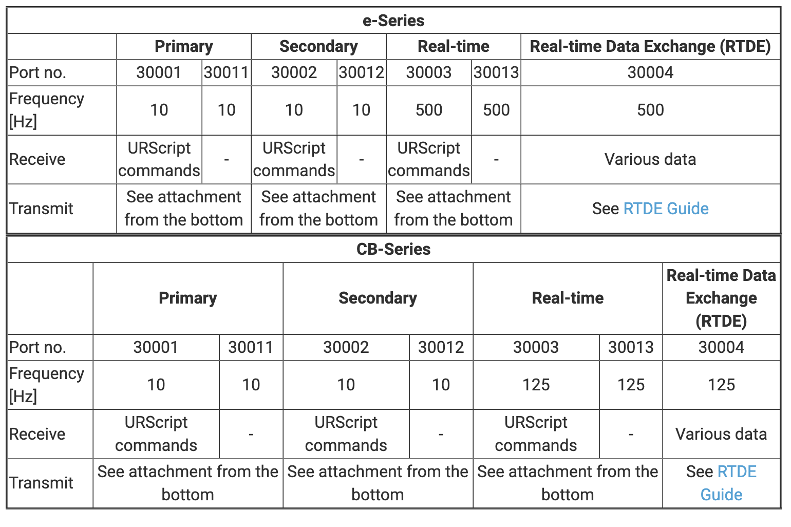

### Features

This repository provides wrappers for most of the SDKs of the UR E-series robots, including Dashboard (29999), Primary (30001 & 30011), Secondary (30002 & 30012), RTDE (30004), and Interpreter Mode (30020). Some of these ports have corresponding Python programs provided by UR officially (such as RTDE and Interpreter Mode), and this repository wraps and integrates them.

All functionality and command wrappers are based as closely as possible on the official UR PDF documentation.

### Usage

**Dashboard**

**Primary & Secondary**

**RTDE**

**Interpreter Mode**

### Port Introduction

UR Robots provide ports for developers to perform secondary development, including Dashboard, Primary, Secondary, Real-time, RTDE, and Interpreter mode. Below is UR's definition of these ports:



#### Dashboard

This port controls the robot at the overall level, such as powering on/off, loading programs and installation files, running programs, etc. It is suitable for scenarios where various programs and operating conditions have been implemented but require remote control for power on/off, operation, or program switching.

#### Primary & Secondary

**Primary**

Divided into ports 30001 and 30011. For port 30001, when users connect to this port, the robot continuously reports specified data, and users can also send specified script scripts to operate the robot. Port 30011 only reports data, which is consistent with the data from port 30001.

In other words, 30001 is primarily used for control, while 30011 is mainly used for monitoring.

**Secondary**

Divided into ports 30002 and 30012. For port 30002, when users connect to this port, the robot continuously reports specified data, and users can also send specified script scripts to operate the robot. Port 30012 only reports data, which is consistent with the data from port 30001.

In other words, 30002 is primarily used for control, while 30012 is mainly used for monitoring.

**Similarities**

If Dashboard controls the robot at an overall level without involving specific script content, Primary and Secondary control the robot at the script command level, including robot movement, IO control, etc.

Both 30001 and 30002 have the functionality to receive user-issued scripts and report related robot states.

Both 30011 and 30012 only report related robot states.

**Differences**

The Primary port is mainly used to send the main program, including the overall logic or movement-specific programs. When a Primary script is sent, if another Primary script is sent afterward, the first-running script will be interrupted.

The Secondary port is mainly used for IO control, and commands sent through Secondary are completed immediately without delays or blocking commands. However, non-blocking commands can also be sent through the Primary port. To differentiate, we generally use the Primary port to send main programs and the Secondary port for controlling IO states. When a Primary script is sent, sending a Secondary script command will not interrupt the previously sent script.

The format for a Primary script is as follows:

```
def thisIsPrimaryProgram():
	# main program
end
```

The format for a Secondary script is as follows:

```
sec thisIsSecondaryProgram():
	# io script
end
```

Of course, single-line scripts can be sent directly without using def or sec and end for encapsulation.

#### RealTime

This port is a data pipeline stream that transmits specified data at a frequency of 125 Hz. Due to version updates of UR robots, the data format of this port changes with each update, making it inconvenient for users to parse. It is no longer recommended after version 3.5, with RTDE port suggested as an alternative.

#### RTDE

RTDE stands for Real-Time Data Exchange, with a maximum frequency of 500 Hz. This port uses a subscription-publishing mechanism, allowing users to freely choose the data they want to subscribe to.

#### Interpreter Mode

When using Primary, new def scripts cannot be sent while a script is running. Interpreter Mode provides the ability to send def commands during runtime.

By specifying a function to enable Interpreter Mode in the script, it will wait for port 30020 to receive and execute valid def scripts. This provides great convenience for executing additional scripts during runtime.

### References

* [Dashboard Server](https://www.universal-robots.com/articles/ur/dashboard-server-e-series-port-29999/)
  * [DashboardServer_e-Series_2022.pdf](https://s3-eu-west-1.amazonaws.com/ur-support-site/42728/DashboardServer_e-Series_2022.pdf)
* [Overview of client interfaces (Primary/Realtime)](https://www.universal-robots.com/articles/ur/interface-communication/client-interfaces-primarysecondary-and-realtime/)
  * [ScriptManual_SW5.11.pdf](https://s3-eu-west-1.amazonaws.com/ur-support-site/115824/scriptManual_SW5.11.pdf)
  * [ClientInterfaces_Primary.pdf](https://s3-eu-west-1.amazonaws.com/ur-support-site/16496/ClientInterfaces_Primary.pdf)
* [Interpreter mode](https://www.universal-robots.com/articles/ur/programming/interpreter-mode/)
  * [ScriptManual_SW5.11.pdf](https://s3-eu-west-1.amazonaws.com/ur-support-site/115824/scriptManual_SW5.11.pdf)
* [Real-Time Data Exchange (RTDE) Guide)](https://www.universal-robots.com/articles/ur/interface-communication/real-time-data-exchange-rtde-guide/)
  * [Real-Time Data Exchange (RTDE).pdf](https://s3-eu-west-1.amazonaws.com/ur-support-site/22229/Real_Time_Data_Exchange_(RTDE)_Guide.pdf)
