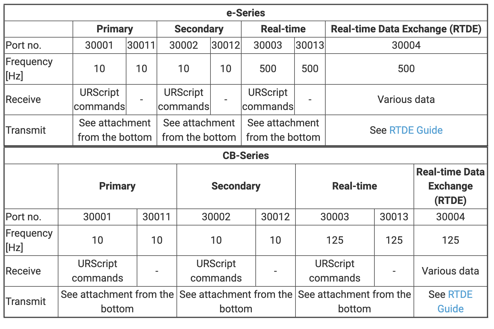

### 功能

本仓库提供了对UR E 系列机器人绝大多数SDK的封装，包括Dashboard（29999）、Primary（30001&30011）、Secondary（30002&30012）、RTDE（30004）、Interpreter mode（30020）功能。其中一些端口的功能UR官方已经提供对应的Python程序（如RTDE和Interpreter Mode），而本仓库对其进行了封装和整合。

所有的功能和指令的封装均尽量基于UR官方的PDF文档说明。

### 如何使用

**Dashboard**


**Primary & Secondary**


**RTDE**


**Interpreter Mode**


### 端口介绍

UR Robot为开发者开放了Dashboard、Primary、Secondary、Real-time、RTDE、Interpreter mode等端口用来进行二次开发。下面是UR对端口的定义：



#### Dashboard

该端口在整个机器人层面对机器人进行控制，例如上下电，加载程序和安装文件，运行程序等，适用于一些各种程序和运行条件已经实现，但是需要进行远程控制开关机运行或者切换程序的第三方上位控制时。

#### Primary & Secondary

**Primary**

共分为30001和30011两个端口，其中对于30001端口，当用户链接上该端口后，机器人会不断上报指定的数据，同时用户也可以下发指定的script脚本去运行机器人，而30011端口则只上报数据，上报的数据于30001端口是一致的。

也就是说30001主要用作控制，而30011主要用来监控。

**Secondary**

共分为30002和30012两个端口，其中对于30002端口，当用户链接上该端口后，机器人会不断上报指定的数据，同时用户也可以下发指定的script脚本去运行机器人，而30012端口则只上报数据，上报的数据于30001端口是一致的。

也就是说30002主要用作控制，而30012主要用来监控。

**相同点**

如果说Dashboard是在整个机器人层面进行控制，而不涉及到具体的脚本内容。那么Primary和Secondary就是在脚本指令层面对机器人进行控制，包括机器人的运动，IO控制等等。

30001和30002都同时具有接收用户下发脚本指定和上报机器人相关状态的功能。

而30011和30012都是只上报机器人相关状态。

**不同点**

Primary端口主要用来发送主程序，也可以说包括程序整体逻辑或运动指定的程序。当发送一段Primary脚本后，如果再次发送Primary脚本，第一次运行的脚本会被打断。
而Secondary端口则主要进行IO控制等，并且Secondary发送的命令是立马可以完成的，不能包含延时，运动等阻塞的命令，当然，这些非阻塞的命令也可以通过Primary端口发送，为了区分，我们尽量使用Primary端口发送主程序，而使用Secondary端口来控制一些IO状态等。当发送了一段Primary脚本后，如果发送Secondary脚本命令，则第一次发送的脚本不会被打断。

Primary脚本格式如下所示：

```
def thisIsPrimaryProgram():
	# main program
end
```

Secondary脚本格式如下所示：

```
sec thisIsSecondaryProgram():
	# io script
end
```

当然如果是单行脚本的话，不使用def或sec和end进行封装也是可以直接发送的。

#### RealTime

该端口为数据管道流，当链接到该端口后会以125hz的频率流式传输指定的数据。由于UR机器人的每次版本更新，导致该端口每次的数据格式都会发生变化，用户解析起来不是非常方便，在3.5版本之后已经不推荐使用，而是建议RTDE端口代替。

#### RTDE

RTDE称为Real-Time Data Exchange（实时数据交换），最高频率为500hz。该端口拥有订阅-发布机制，可以自由选择需要订阅的数据。

#### Interpreter Mode

当我们使用Primary时，当脚本正在运行时，我们是无法发送一些新的def脚本的。而Interpreter Mode则提供了在运行时发送def命令的可能。

我们可以通过发送的script脚本中指定函数开启interpreter mode，开启后则等待30020接收有效的def脚本并执行。这就为在运行时执行一些额外的脚本提供了很大的便捷性。

### 参考

- [Dashboard Server](https://www.universal-robots.com/articles/ur/dashboard-server-e-series-port-29999/)
  - [DashboardServer_e-Series_2022.pdf](https://s3-eu-west-1.amazonaws.com/ur-support-site/42728/DashboardServer_e-Series_2022.pdf)
- [Overview of client interfaces (Primary/Realtime)](https://www.universal-robots.com/articles/ur/interface-communication/client-interfaces-primarysecondary-and-realtime/)
  - [ScriptManual_SW5.11.pdf](https://s3-eu-west-1.amazonaws.com/ur-support-site/115824/scriptManual_SW5.11.pdf)
  - [ClientInterfaces_Primary.pdf](https://s3-eu-west-1.amazonaws.com/ur-support-site/16496/ClientInterfaces_Primary.pdf)
- [Interpreter mode](https://www.universal-robots.com/articles/ur/programming/interpreter-mode/)
  - [ScriptManual_SW5.11.pdf](https://s3-eu-west-1.amazonaws.com/ur-support-site/115824/scriptManual_SW5.11.pdf)
- [Real-Time Data Exchange (RTDE) Guide)](https://www.universal-robots.com/articles/ur/interface-communication/real-time-data-exchange-rtde-guide/)
  - [Real-Time Data Exchange (RTDE).pdf](https://s3-eu-west-1.amazonaws.com/ur-support-site/22229/Real_Time_Data_Exchange_(RTDE)_Guide.pdf)


